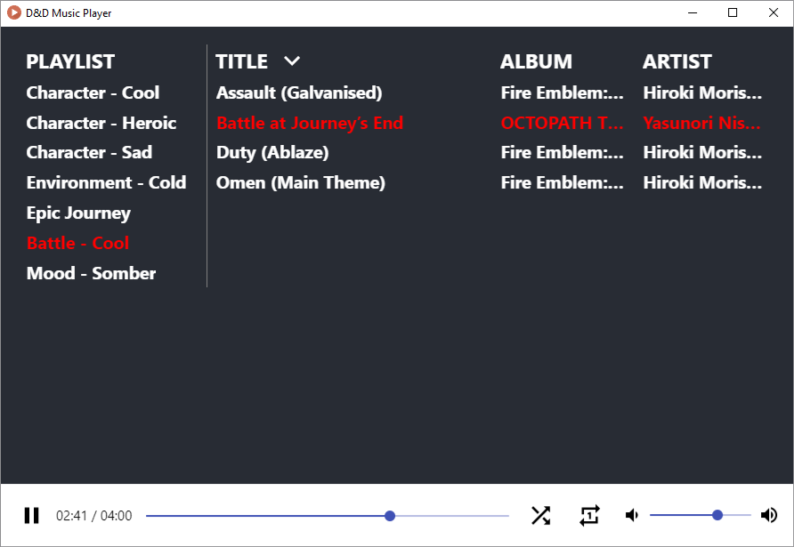

# D&D Music Player (WIP)



How does it work? Drag and drop mp3 files into the app then use it like so:


This project was bootstrapped with [React Electron](https://github.com/willjw3/react-electron) by [willjw3](https://github.com/willjw3).

## Easy install

If you just want to use the music-player, please only follow the steps in this section.

1. Go to the [releases](https://github.com/spoge/dnd-music-player/releases) page
2. Download newest version & Install

#

## Hacker install

1. Clone repository

```
git clone git@github.com:spoge/dnd-music-player.git
```

2. Install `yarn` globally

```
npm install -g yarn
```

3. Navigate into project root and install dependencies

```
cd dnd-music-player && npm install
```

4. Run dev server

```
npm run start
```

## Deploy to Desktop

1. Run the build process

```
npm run build
```

2. You should now see the install file:`project-root/dist/dnd-music-player Setup 0.1.0.exe` in the file explorer.

3. Have fun!
